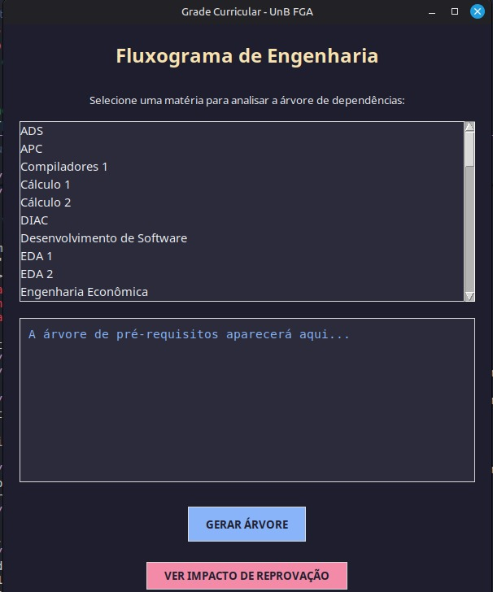
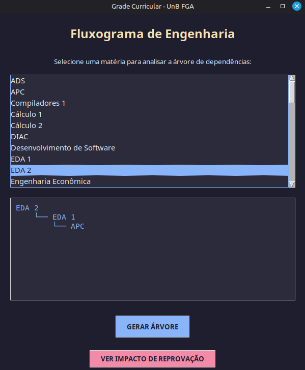
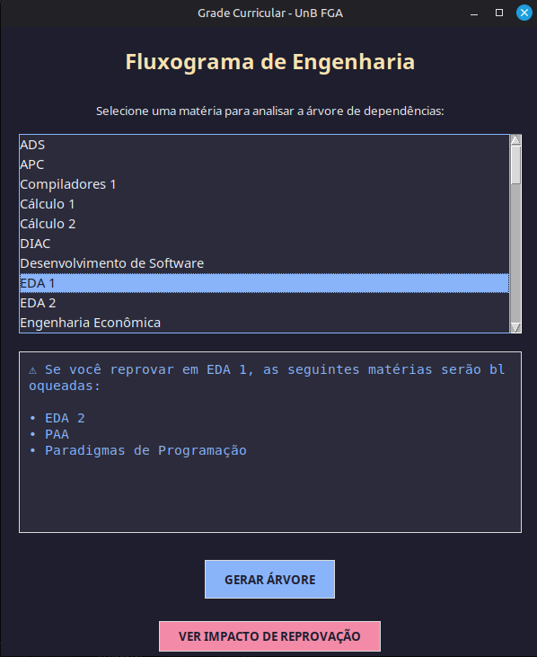

# GrafoGuiaGrade

Número da Lista: 54 
Conteúdo da Disciplina: Grafos 

## Alunos

| Matrícula  | Aluno                   |
| ---------- | ----------------------- |
| 22/2024837 | Guilherme Costa Zanella |
| 22/2014910 | Pablo Cunha de Jesus    |

## Sobre

Este projeto tem como objetivo organizar disciplinas com base em seus pré-requisitos, gerando uma ordem válida para cursá-las ou estudá-las.

## Screenshots

### Tela Inicial

### Pre Requisitos

### Impacto Reprovação

## Instalação

Linguagem: Python 3 
Framework: (caso exista) 
Pré-requisitos:

- [Python 3.13+](https://www.python.org/)
- [Tkinter](https://docs.python.org/3/library/tkinter.html) (Interface Gráfica)

## Uso

Tela Principal: Ao abrir o programa, você verá uma lista com todas as disciplinas do curso de Engenharia de Software.

Seleção: Clique sobre o nome de uma disciplina (ex: MDS ou PAA).

Gerar Árvore: Clique no botão "GERAR ÁRVORE".

Resultado: O painel inferior exibirá toda a linhagem de pré-requisitos necessários para chegar até a matéria selecionada, formatado em uma estrutura de árvore hierárquica.

## Outros

Quaisquer outras informações sobre seu projeto podem ser descritas abaixo.
